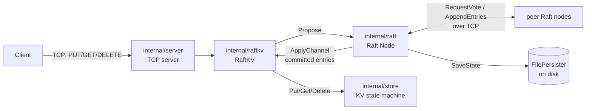

# Raft-KV

A distributed key-value store in Go, built from scratch on top of a
from-scratch implementation of the [Raft consensus algorithm][raft-paper].

**This is an educational / portfolio project, not a production database.**
It was built to implement and demonstrate real Raft consensus mechanics —
leader election, replicated logs, majority commit, crash recovery — end to
end, with an emphasis on correctness under concurrency and failure rather
than performance, feature breadth, or operational hardening. See [Known
Limitations](#known-limitations) for what it deliberately does not do.

[raft-paper]: https://raft.github.io/raft.pdf

## Key features

- Leader election with randomized election timeouts
- `RequestVote` / `AppendEntries` RPCs over a real TCP transport
- A replicated log with majority-based commit
- Follower log repair (conflicting-entry truncation, `nextIndex` backtracking)
- Recovery from network partitions, minority-side write rejection
- Leader failure and re-election, verified to elect exactly one leader per term
- Consensus-backed `PUT` / `DELETE`; writes return only after commit *and* apply
- A leader-only `GET` consistency model (see [Design Decisions](#design-decisions))
- A concurrent, line-based TCP server for client connections
- Durable, file-backed Raft persistence (atomic writes, fsync'd)
- Crash/restart recovery — a restarted node reloads its term, vote, and log
- Fail-stop handling of persistence failures (a node that can't durably
  persist state stops participating rather than risk violating Raft's
  safety guarantees)
- Graceful shutdown of both the client server and the Raft transport
- A race-tested implementation (`go test -race`) covering election safety,
  replication, partitions, and crash recovery
- 106 automated tests

## Architecture



Packages, inner to outer:

- **`internal/store`** — a thread-safe, in-memory `map[string]string`. The
  local state machine every node applies committed commands to. Knows
  nothing about Raft, networking, or clients.
- **`internal/raft`** — the consensus algorithm itself: node roles, terms,
  elections, the replicated log, `AppendEntries`/`RequestVote` handling,
  and persistence. Exposes `Propose`, an `ApplyChannel` of committed
  entries, and a `Transport` interface (`TCPTransport` for real networking,
  `FakeTransport` for deterministic tests). Knows nothing about keys,
  values, or clients — it replicates opaque `[]byte` commands.
- **`internal/raftkv`** — glues `raft.Node` to `store.Store`. Encodes
  client writes as commands, proposes them, and blocks the caller until
  the resulting log entry commits *and* is applied locally. Implements
  `server.KV`, so from the server's point of view it's just another
  key-value backend.
- **`internal/server`** — the client-facing TCP server and line protocol.
  Depends only on the small `KV` interface (`Put`/`Get`/`Delete`), so it
  works identically whether `KV` is a plain `store.Store` (no consensus,
  single node) or a `raftkv.RaftKV` (replicated).
- **`cmd/node`** — the binary: wires up a `store.Store`, optionally a
  `raft.Node` + `raftkv.RaftKV` (when `-id` is set), and a `server.Server`,
  then runs until an interrupt/TERM triggers a graceful shutdown.

## The write path

A `PUT foo bar` sent to the current leader takes this path before the
client sees `OK`:

1. The TCP server parses the line and calls `RaftKV.Put("foo", "bar")`.
2. `RaftKV` encodes it as a JSON command (`{"op":"PUT","key":"foo","value":"bar"}`)
   and calls `Node.Propose`, which appends it to the leader's own log and
   persists it durably.
3. The leader sends `AppendEntries` to every follower (immediately, not
   just on the next heartbeat).
4. Once a **majority** of nodes (including the leader) have durably
   persisted the entry, the leader advances `commitIndex`.
5. The committed entry is delivered on `Node.ApplyChannel()`.
6. `RaftKV`'s apply loop applies it to the local `store.Store` — this is
   the point at which the key-value data actually changes.
7. Only now does `RaftKV.Put` return, and the client receives `OK`.

**A successful write is only ever acknowledged after it has been committed
by a majority and applied to the local state machine** — never merely
appended to the leader's own log. If the leader crashes or loses
leadership after step 2 but before commit, the caller gets an error
(timeout or lost-leadership), never a false `OK`.

## Failure behavior

- **A follower dies:** the leader keeps replicating to the remaining
  nodes. Writes continue to commit as long as a majority (including the
  leader) is reachable.
- **The leader dies:** followers stop receiving heartbeats, their
  election timeouts fire, and one of them becomes a candidate and (if it
  gets votes from a majority) the new leader for a higher term. Clients
  talking to the old leader's address see connection failures; clients
  talking to a follower get `NOT_LEADER`.
- **A node is partitioned away from the majority:** if it's a follower,
  it can't win an election (it can't get majority votes) and simply
  stalls. If it was the leader, it can no longer commit writes (no
  majority acks) — writes proposed to it time out — while the majority
  side elects a new leader in a higher term and continues serving writes.
- **A lagging/rejoined follower:** the leader detects the log mismatch
  via `AppendEntries` rejection, backtracks that follower's `nextIndex`,
  and resends until the follower's log matches, at which point it resumes
  normal replication. No special "recovery" mode — it's the same conflict
  -repair path used for any follower that falls behind.
- **A process restarts:** it reloads `currentTerm`, `votedFor`, and its
  full log from disk (`FilePersister`), rejoins as a follower, and is
  brought back in sync by the current leader like any other lagging
  follower. Uncommitted entries from before the crash may be truncated if
  they conflict with the current leader's log; committed entries never
  are.
- **Persistence fails (e.g. disk write error):** the node fail-stops —
  it stops granting votes, stops accepting/acknowledging new log entries,
  and will not resume even if the underlying disk error later clears,
  because it can no longer prove the state it would be acting on next was
  actually saved. This trades availability of that one node for the
  stronger guarantee that it never violates Raft safety (double-voting in
  a term, or reporting a commit that isn't durable) by silently operating
  on unpersisted state. Recovering it requires a restart.

## Running a real 3-node cluster

Build the binary:

```sh
go build -o bin/node ./cmd/node
```

Start three nodes, each with its own client address, Raft address, and
data directory:

```sh
mkdir -p data/node1 data/node2 data/node3

./bin/node -id=node1 -addr=:9001 -raft-addr=:9101 \
  -peers=node2=localhost:9102,node3=localhost:9103 -data-dir=data/node1

./bin/node -id=node2 -addr=:9002 -raft-addr=:9102 \
  -peers=node1=localhost:9101,node3=localhost:9103 -data-dir=data/node2

./bin/node -id=node3 -addr=:9003 -raft-addr=:9103 \
  -peers=node1=localhost:9101,node2=localhost:9102 -data-dir=data/node3
```

Each node logs its role/term/leader whenever it changes, e.g.:

```
raft: term=1 role=Candidate leader=
raft: term=1 role=Leader leader=node2
```

Talk to whichever node is currently the leader (say node2, on port 9002)
with `nc`:

```sh
$ printf 'PUT movie inception\r\nGET movie\r\nDELETE movie\r\nGET movie\r\n' | nc localhost 9002
OK
VALUE inception
OK
NOT_FOUND
```

Both `PUT`/`DELETE` (always) and `GET` (in this leader-only model) are
rejected on a non-leader node:

```sh
$ printf 'PUT movie inception\r\n' | nc localhost 9001
ERR NOT_LEADER leader=node2
```

## Failure demo

A reproducible walkthrough of leader failure and recovery, using the
3-node cluster above:

1. Start all three nodes as shown above and watch the logs until one
   becomes leader, e.g. `node2`.
2. Write a value through it: `printf 'PUT movie inception\r\n' | nc localhost 9002` → `OK`.
3. Kill node2 (`Ctrl+C`, or `kill <pid>`). Within one election timeout,
   the surviving nodes log a new election and a new leader for a higher
   term, e.g. `raft: term=2 role=Leader leader=node3`.
4. Read and write through the new leader:
   `printf 'PUT movie oppenheimer\r\n' | nc localhost 9003` → `OK`.
   Interestingly, `GET movie` against the new leader *immediately* after
   failover (before writing again) can return `NOT_FOUND` even though the
   old leader had returned `OK` for it — this is correct Raft behavior,
   not a bug: a new leader can only advance its own `commitIndex` past
   entries from *its own* current term (Raft §5.4.2); a prior-term entry
   it already holds becomes visible once a new current-term entry
   commits, since a leader's log is a superset of everything before it.
   The very next successful write makes both visible.
5. Restart node2 with the same flags and data directory it used before.
   It logs that it rejoined as a follower of the current leader/term
   immediately (`raft: term=2 role=Follower leader=node3`) and catches up
   via ordinary log replication (or `AppendEntries` conflict-repair, if it
   had missed entries) — no special recovery command is needed.
6. Its `-data-dir/raft-state.json` file, inspected directly, contains the
   full replicated log, including entries appended while it was down.

## Testing

```sh
go test ./...          # run the full suite
go test -race ./...    # with the race detector (recommended)
go vet ./...
go build ./...
```

The suite currently has **106 tests** across `internal/raft`,
`internal/raftkv`, `internal/server`, and `internal/store`, all passing
under `-race`. Categories include:

- Leader election: single candidate, split votes retrying at a higher
  term, exactly-one-leader-per-term under concurrent elections
- Network partitions: minority side can't commit, both sides converge
  once the partition heals
- Log replication and conflict repair: `nextIndex` backtracking,
  conflicting-entry truncation, followers catching up after lagging
- Commit behavior: no commit without a majority, commit only via a
  current-term entry, entries applied exactly once and in order
- Concurrent client proposals racing the apply loop
- Crash/restart: state (term/vote/log) surviving restarts, restarts not
  double-voting in the same term, repeated restart cycles
- Persistence: atomic save/load round-tripping, corrupted/partially
  written state files detected at startup rather than silently accepted,
  injected persistence failures (fail-stop behavior)
- TCP transport and the client-facing line protocol, including malformed
  input that must not crash a connection or the server
- Regression tests written for specific concurrency bugs found during
  development (e.g. a `nextIndex` backtracking edge case, a propose/apply
  race before waiter registration)

This is unit and integration testing with real concurrency (`-race`) and
injected failures — not formal or model-checked verification of Raft's
safety properties.

## Design decisions

- **Go:** goroutines and channels map naturally onto Raft's per-role event
  loops and the apply pipeline; the standard library's `net`, `testing`,
  and race detector cover everything this project needed.
- **A thread-safe local store, separate from Raft:** `store.Store` knows
  nothing about consensus, so it's trivial to test alone and is exactly
  what both a non-replicated node and every replicated node's state
  machine can share.
- **The `server.KV` interface:** the TCP server depends on `Put`/`Get`/
  `Delete`, not on a concrete store, so `cmd/node` can wire up either a
  plain `store.Store` or a `raftkv.RaftKV` with no change to `internal/server`.
- **A sentinel log entry at index 0, term 0:** every log always has a
  first real entry at index 1, so `prevLogIndex`/`prevLogTerm` checks in
  `AppendEntries` never need special-casing an empty log.
- **`nextIndex`/`matchIndex` per follower:** the standard Raft mechanism
  for a leader to track what each follower has and to backtrack after a
  rejected `AppendEntries` until logs converge.
- **Commit only via a current-term entry (§5.4.2):** a leader never
  concludes an older-term entry is committed purely by counting replicas
  of it — only a majority-replicated entry from its own term commits,
  which safely commits every entry before it too. This is what produces
  the `GET` behavior described in the [failure demo](#failure-demo).
- **A proposal-waiter mechanism keyed by (index, term):** `RaftKV.Put`/
  `Delete` block on a channel registered for the entry's index, with the
  term double-checked at resolution time so a caller can never be told
  "success" for a different entry that happens to reuse the same log
  index after a leadership change.
- **Fail-stop on persistence failure:** rather than risk continuing to
  vote or acknowledge entries after a save that may or may not have
  actually reached disk, a node that fails to persist stops permanently.
  Losing one node's availability is preferable to a silent safety
  violation.
- **Atomic file persistence:** `FilePersister` writes to a temp file,
  fsyncs it, renames it over the real state file, and fsyncs the
  directory — so a crash mid-write can never leave a partially written or
  missing state file; the previous valid state is always recoverable.

## Known limitations

- No snapshots or log compaction — the log grows unbounded for the
  lifetime of a run.
- No dynamic membership changes — the peer set is fixed at startup via
  `-peers`.
- No `ReadIndex` or lease-based linearizable reads — see the leader-read
  caveat in [Design decisions](#design-decisions) and `RaftKV`'s doc
  comment.
- Leader-only `GET` reflects only what the node *currently believes*
  about its own leadership; there's no cross-check against a majority at
  read time.
- No automatic client redirection or proxying — a client hitting a
  non-leader node gets `NOT_LEADER leader=<id>` back and must reconnect
  to that address itself.
- No TLS or authentication — the TCP protocol (client-facing and
  Raft-to-Raft) is plaintext with no access control.
- No production-grade storage engine — `store.Store` is an in-memory Go
  map guarded by a mutex, not a WAL-backed or LSM-based engine.
- Simple `nextIndex` backtracking (decrement by one and retry) rather
  than an optimized conflict-index/conflict-term hint in the
  `AppendEntries` response — correct, but not the fastest way to recover
  a badly lagging follower.
- No checksum on the persisted state file beyond structural validation
  (version, contiguous indexes, sentinel entry, etc.) — corruption that
  happens to still parse as valid JSON with a self-consistent log is not
  detected.
- `TCPTransport` opens a new connection per RPC rather than pooling or
  reusing connections, which is simple and correct but not the most
  efficient use of the network under high replication load.

## Benchmark

```sh
go test ./internal/raftkv -run '^$' -bench BenchmarkSingleNodePut -benchtime 500x
```

`BenchmarkSingleNodePut` measures end-to-end `Put` latency through the
real pipeline — propose, durable on-disk persistence (a real
`FilePersister`, not an in-memory fake), commit, apply — on a single-node
cluster, where commit requires a majority of one. This isolates the cost
that dominates every write regardless of cluster size: synchronous disk
persistence plus the surrounding Raft/RaftKV bookkeeping. It does not
include network round trips to peers or the client-facing TCP protocol.

Measured result (single run, for context — not a guarantee of
performance in any other environment):

```
goos: darwin
goarch: arm64
pkg: raftkv/internal/raftkv
cpu: Apple M1 Pro
BenchmarkSingleNodePut-10    500    10970052 ns/op    71082 B/op    33 allocs/op
```

≈11ms/op, ≈91 writes/sec, on a MacBook with Apple M1 Pro, stable across
repeated runs (10.7–11.2ms/op observed across 5 repeats). This number is
almost entirely `fsync` latency on this machine's disk, not algorithmic
overhead — it will vary significantly by machine, disk, and OS, and
should not be read as a claim about the implementation's ceiling.

A three-node variant was tried and deliberately not used for this number:
under a synthetic zero-think-time tight loop (not representative of a
real client), it occasionally produced misleading timeouts caused by a
limitation of the in-memory `FakeTransport` test double used in that
harness (it checks a call's context deadline once up front rather than
enforcing it for the call's duration), not by the consensus algorithm or
by the real `TCPTransport` (which uses real socket deadlines). Rather
than change production code to smooth over a test-harness artifact, the
benchmark reports the single-node number, which is stable and still
measures the real, dominant cost of a write: durable persistence. See the
comment in `internal/raftkv/benchmark_test.go` for the full explanation.

## Running with Docker

A `Dockerfile` and `docker-compose.yml` are included for a
zero-install way to run a real 3-node cluster — they run the exact same
binary and flags as the manual walkthrough above, just wired up by
Compose instead of by hand, with named volumes for each node's data
directory and Compose's built-in service-name DNS for peer addressing.

```sh
docker compose up --build

# in another terminal:
nc localhost 9001   # node1 (node2: 9002, node3: 9003)
```

```sh
docker compose down -v   # stop and wipe persisted state
```

*(The Docker configuration was written and reviewed carefully but could
not be run in the environment this project was developed in, which has
no Docker daemon available — verify locally before relying on it.)*

## Protocol reference

Requests are one line each, `\r\n`- or `\n`-terminated:

| Command | Format | Success response | Error responses |
|---|---|---|---|
| `PUT` | `PUT <key> <value>` | `OK` | `ERR NOT_LEADER leader=<id>`, `ERR TIMEOUT`, `ERR LEADERSHIP_LOST leader=<id>` |
| `GET` | `GET <key>` | `VALUE <value>` or `NOT_FOUND` | `ERR NOT_LEADER leader=<id>` (Raft mode only) |
| `DELETE` | `DELETE <key>` | `OK` | same as `PUT` |

`<value>` may contain spaces; everything after the key on a `PUT` line is
taken verbatim as the value. Malformed lines get `ERR <message>` and do
not close the connection.

## CLI flags (`cmd/node`)

| Flag | Default | Meaning |
|---|---|---|
| `-addr` | `:9000` | TCP address for client (KV) connections |
| `-id` | `""` | Raft node ID; empty runs a standalone node with no consensus or persistence |
| `-raft-addr` | `:9100` | TCP address for Raft RPCs from peers |
| `-peers` | `""` | comma-separated `id=host:port` list of the other nodes |
| `-data-dir` | `""` | directory for this node's persisted Raft state; required when `-id` is set, must be unique per node |
